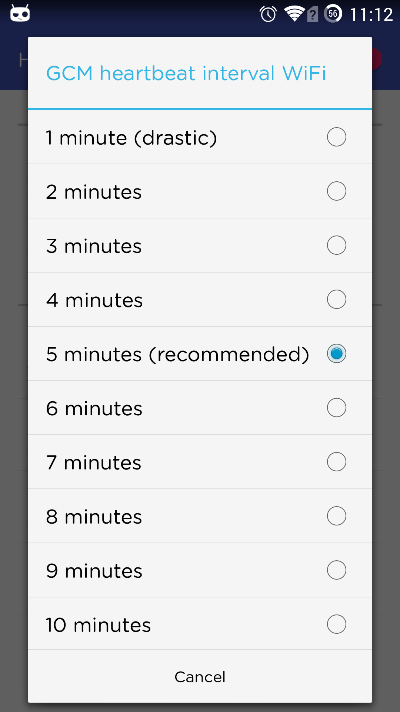
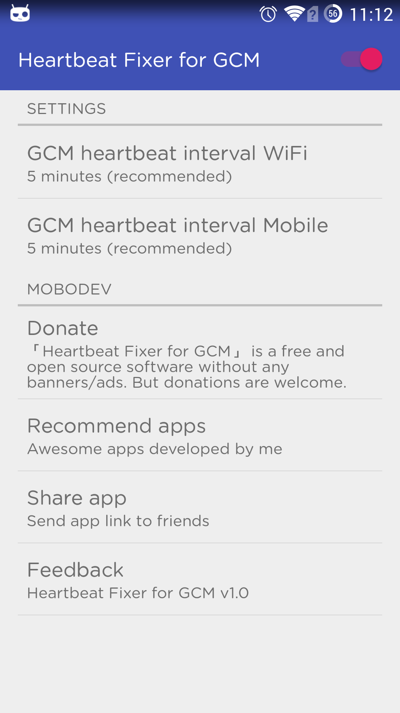

[![Get it on Google Play][2]][1]

## Heartbeat Fixer for GCM

Have you ever experience **Push Notification Delay**, missing something important. Here is the tool for fixing GCM heartbeat interval issue.

### The Root Cause

The **root** cause of this issue can be found at [Push notifications delayed, Heartbeat Interval not reliable](https://productforums.google.com/forum/#!msg/nexus/fslYqYrULto/lU2D3Qe1mugJ)

### How Heartbeat Fixer for GCM resolve this issue

It sends an heartbeat every x minutes, where you can choose the interval. Setting it to 5 minutes will keep alive the GCM connection used for push notifications.

### Build 

    ./gradlew assembleDebug

## Install

   ./gradlew instDebug

### Screenshots

License
-------

    Copyright 2015 Bin Shao

    Licensed under the Apache License, Version 2.0 (the "License");
    you may not use this file except in compliance with the License.
    You may obtain a copy of the License at

       http://www.apache.org/licenses/LICENSE-2.0

    Unless required by applicable law or agreed to in writing, software
    distributed under the License is distributed on an "AS IS" BASIS,
    WITHOUT WARRANTIES OR CONDITIONS OF ANY KIND, either express or implied.
    See the License for the specific language governing permissions and
    limitations under the License.

 [1]: https://play.google.com/store/apps/details?id=io.github.mobodev.heartbeatfixerforgcm
 [2]: http://www.android.com/images/brand/get_it_on_play_logo_small.png
